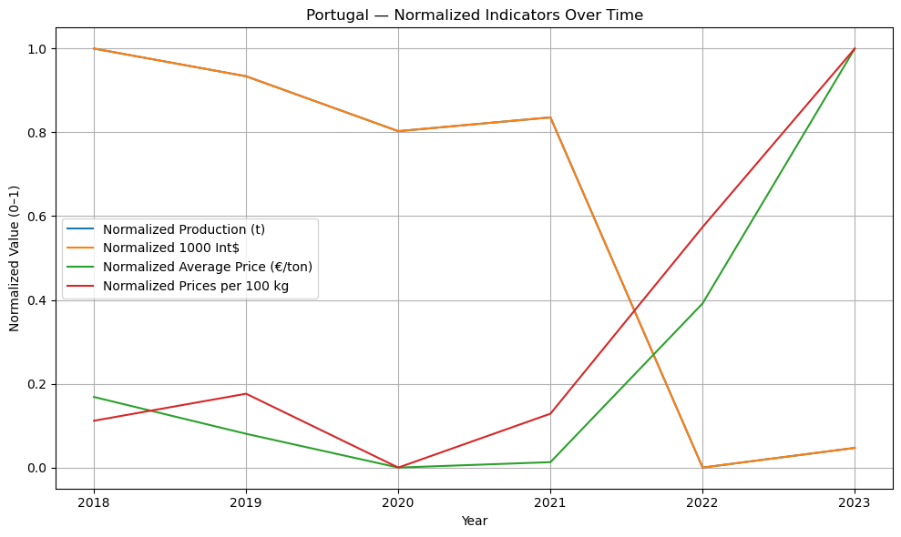

# 🥔 Hypotato
This is a small project about the globan trends of potato, just some data cleaning and displaying mainly with Python.

## Data Sets
- [Eurostat](https://ec.europa.eu/eurostat/en/)
- [FAOSTAT](https://www.fao.org/faostat/en/#home)
- [Observatório de Preços](https://observatorioagroalimentar.gov.pt/)

## Overview
Hypotato explores potato production, pricing, and trade trends across Europe and globally. It combines datasets from Eurostat, FAOSTAT, and the Portuguese Agricultural Price Observatory to analyze:
- Production volumes
- Market prices
- Trade values
- Country-level comparisons

## Example
- Portugal-specific with extra data

This is a normalized graph with the max and min of this period of dates.

## Tools & Technologies
- Python (pandas, matplotlib, sklearn, sqlite3)
- Jupyter Notebooks and Python scripts
- SQLite

