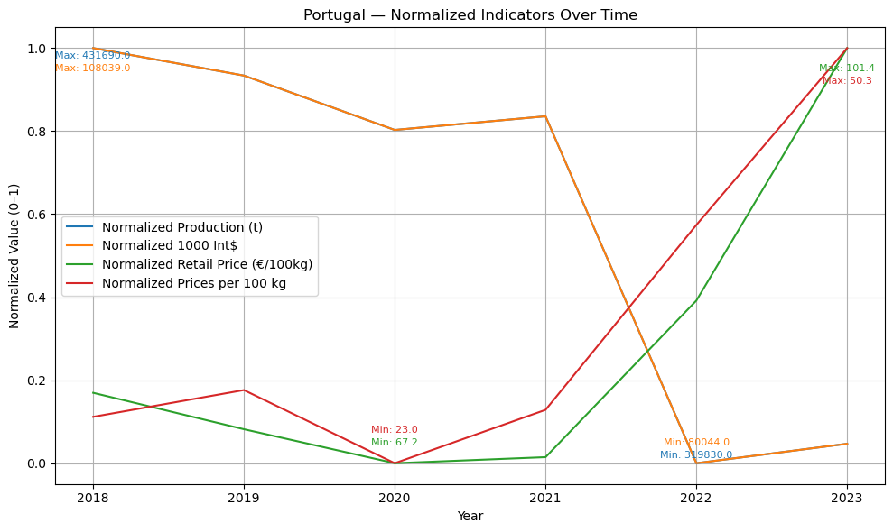

# 🥔 Hypotato
Explore the trends of global potato production, pricing, and trade. From international statistics to local market observations, this project digs into the root of the potato economy.

## Data Sets
- [Eurostat](https://ec.europa.eu/eurostat/en/)
- [FAOSTAT](https://www.fao.org/faostat/en/#home)
- [Observatório de Preços](https://observatorioagroalimentar.gov.pt/)

## Overview
Hypotato explores potato production, pricing, and trade trends across Europe and globally. It combines datasets from Eurostat, FAOSTAT, and the Portuguese Agricultural Price Observatory to analyze:
- Production volumes
- Market prices
- Trade values
- Country-level comparisons

## Example Plot

## Tools & Technologies
- Python (pandas, matplotlib, sklearn, sqlite3)
- Jupyter Notebooks or Python scripts
- SQLite for relational joins

